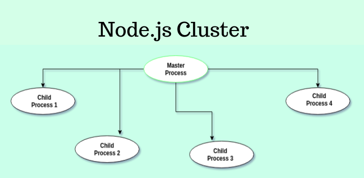

### What is Node.js, and how does it differ from traditional server-side technologies like Apache ?

Ans: **Nodejs** is a `javascript runtime` environment which built on top of Chrome's V8 engine, NodeJs has and event-driven
architecture and capable of running `asynchronous I/O` aka `non-blocking I/O` operation.

### Explain the event-driven, non-blocking I/O model in Node.js ?

Ans:

### How do you install Node.js on your system ?

Ans: Download the LTS version of node version and install and then verify with `node -v`.

### What is npm, and what is its purpose in the Node.js ecosystem?

Ans: npm stands for node package manager which manage the third party dependencies.

### What is the package.json file in Node.js, and what is its significance?

Ans: Package.json file keeps the configuration and metadata file of the project.It defines project information, dependencies, scripts, and configuration, and acts as the heart of a Node.js application.

- **Project Metadata**

```ts
{
  "name": "my-app",
  "version": "1.0.0",
  "description": "Sample Node.js application"
}
```

- **Dependency**

```ts
"dependencies": {
  "express": "^4.18.2"
},
"devDependencies": {
  "nodemon": "^3.0.1"
}
```

- **script**

```ts
"scripts": {
  "start": "node index.js",
  "dev": "nodemon index.js"
}
```

### What is dependency and devdependencies?

Ans:

- **dependencies**: It means the packages which is required to run the application in production.

Example:

```ts
"dependencies": {
  "express": "^4.18.2"
}
```

- **devDependencies:** It means the package which is required to run the application in local.

Example:

```ts
"devDependencies": {
  "nodemon": "^3.0.1"
}

```

### How can you create a simple HTTP server in Node.js?

Ans:

```js
const http = require("http");

const server = http.createServer((req, res) => {
  res.end("Hello from express");
});

server.listen(3000, () => {
  console.log("Server is running on port 3000");
});
```

### HTTP Methods?

- **GET:** Fetch the data from the server.
- **POST:** Create the new Data inside the server.
- **PUT:** Update an existing data(`Full Data`).
- **PATCH** Partial Update
- **DELETE:** Delete the data from server.

### What is a callback function, and how is it commonly used in Node.js?

Ans: A **callback** function is a function that is passed as an argument to another function and is executed later.

In nodejs it is widely used to handle the asynchronous operation but it can lead to callback hell, hard to read and maintain so better to handle with `promise`.

### What is the purpose of the 'require' function in Node.js?

Ans: The `require()` function is used to import the `modules`.

**How It works internally**

- Resolves the module path
- Loads the module (only once)
- Executes the module code
- Caches the result
- Returns `module.exports`

### Explain the concept of the Event Loop in Node.js.

Ans: The `event loop` is part of libuv and is responsible for coordinating `asynchronous operations`. When node.js encounters an asynchronous operation like I/O or timer then then it offloads the task to libuv.

event loop continuously checks callstack and when it finds out it's empty then it pass the callback to this callstack.

There are 6 Phase of event loop

- `timers:` this phase executes callbacks scheduled by setTimeout() and setInterval().

- `pending:` This phase executes callbacks for some system operations such as types of TCP errors.

- `idle:` only used internally.

- `poll:` Where it runs I/O callbacks, like incoming connection, data, fs, crypto, http.get

- `check:` `setImmediate()` callbacks are invoked here.

- `close:` This is the last phase where mostly we do the cleanup and closing, like `socket.on("close")`.

**microtask queue**

- `process.nextTick` queue
- Promise microtask queue (`.then`, `catch`, `finally`)

These microtasks run:

- After the current call stack finishes.
- Before the event loop moves to the next phase.

### What are the core modules in Node.js, and how are they different from external modules?

Ans: Core modules are the built-in modules which comes with nodejs itself.

| Module   | Purpose                  |
| -------- | ------------------------ |
| `fs`     | File system operations   |
| `http`   | Create web servers       |
| `path`   | Handle file paths        |
| `os`     | OS-related information   |
| `events` | Event-driven programming |
| `stream` | Handle streaming data    |
| `crypto` | Cryptography             |
| `url`    | URL parsing              |
| `util`   | Utility functions        |

### What are Promises in Node.js, and how do they differ from callbacks?

Ans: Promises is use to handle the `asynchronous` operation with in the form of resolve or reject. Promises provide better readability, centralized error handling, easier chaining, and enable the use of async/await, which avoids callback hell and improves code maintainability.

A callback is a function passed as an argument to another function, which is executed after some point of time.

```js
// Here callback leads to callback hell problem
doA(() => {
  doB(() => {
    doC(() => {
      doD(() => {
        console.log("done");
      });
    });
  });
});

// same handling with promise chaining
doA().then(doB).then(doC).then(doD).catch(console.error);
```

### Describe the role of the `module.exports` object in Node.js.

Ans: `module.exports` object defines what a module exposes to other files. whatever we assign to `module.exports` that can be imported using `require`.

### How can you handle errors in Node.js applications?

Ans:

### What is the purpose of the `util` module in Node.js?

Ans:

### Explain what `middleware` is in the context of Node.js and Express.js.

Ans: `middleware` is a function that executes between request and response.These functions can modify the request and response objects, end the request-response cycle, or call the next middleware function. Middleware functions are executed in the order they are defined.


**Types of middleware in express**

- **Application-level Middleware:**
  Application-level middleware is bound to an Express application using `app.use()` or `app.METHOD()`. It executes during the request–response cycle and can be applied to all routes or to specific paths and HTTP methods. This type of middleware is commonly used for logging, request body parsing, authentication, and setting headers for incoming requests.

  This type of middleware is commonly used for tasks like logging, body parsing, authentication checks, or setting headers for every incoming request.

  ```js
  app.use(express.json()); // Parses JSON data for every incoming request
  app.use((req, res, next) => {
    console.log("Request received:", req.method, req.url);
    next();
  });
  ```

- **Router-level Middleware:** Applied to specific routers.

```js
const express = require("express");
const router = express.Router();

const authMiddleware = (req, res, next) => {
  // Check for authentication
  if (!req.headers.authorization) {
    return res.status(401).send("Unauthorized");
  }
  next();
};
router.get("/profile", authMiddleware, (req, res) => {
  res.send("User profile data");
});
```

- **Error-handling Middleware:** Error-handling middleware is a special type of middleware used to catch and respond to errors during the request-response cycle.

```js
app.use((err, req, res, next) => {});
```

- **Built-in Middleware:** Provided by Express itself.

  - `express.json()` – parse JSON body

  - `express.urlencoded()` – parse form data

  - `express.static()` – serve static files

- **Third-party Middleware:** These types of middleware is installed via npm.

```js
const express = require("express");

const cookieParser = require("cookie-parser");
const app = express();

app.use(express.json()); // Middleware to parse JSON request bodies
app.use(cookieParser()); // Middleware to parse cookies
...etc
```

### How do you handle file I/O operations in Node.js?

Ans: `fs` is a core module of nodejs that allows to read, write, update, delete and watch the files.

**Ways to Handle File I/O**

**1: Synchronous File I/O (Blocking):** It blocks the event loop.
```js
const fs = require('fs');
const path = require('path');

const filePath = path(__direName, 'test.text', 'utf-8');
fs.createFileSync(filePath, 'Hello from file Sync write')
```

### What is the purpose of the `fs` module in Node.js?

Ans:

### How do you create and use child processes in Node.js?

Ans:

### What is cluster ?

Ans: Cluster is a nodejs core module which is use to scale the application by creating **multiple worker process** from a single master process.

- Each worker runs on it's own **thread/CPU** core.
- All worker share the same port
- If any worker dies then master process automatically restarts it.



```js
if (cluster.isPrimary) {
  const numsOfCpus = os.cpus().length;
  // const numOfCpus = os.availableParallelism;
  console.log(`Primary process is running ${process.pid}`);
  console.log(`Number of cpus ${numsOfCpus}`);
  // fork worker
  for (let i = 0; i < numsOfCpus; i++) {
    cluster.fork();
  }
  cluster.on("exit", (worker) => {
    console.log("Worker " + worker.process.pid + "is died now restarting");
    cluster.fork();
  });
} else {
  app.use("/", (req, res) => {
    res.json({ data: `Hello from express ${process.pid}` });
  });
  app.use("/demo", (req, res) => {
    res.json({ data: `Hello from demo api${process.pid}` });
  });
  app.listen(3000, () => {
    console.log("Server Started on port 3000");
  });
}
```
